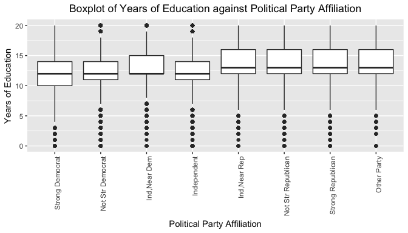
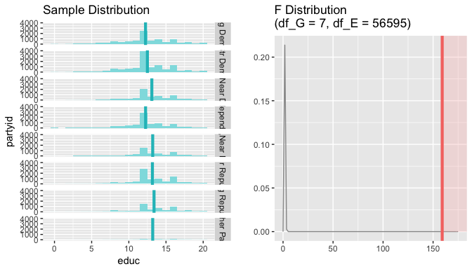

# Statistical inference with the GSS data

## Setup

### Load packages


```r
library(ggplot2)
library(dplyr)
library(statsr)
```

### Load data


```r
load("gss.Rdata")
```

* * *

## Part 1: Data

Since random sampling, not assignment, was used, the data cannot be used to produce causal conclusion. However, since the observations were derived from randomly sampling US citizens, the results can be generalised to the US population. As interview was the method of data collection, it might mean that those who are not available for the interview will not be included in this study, thus might lead to questionable results.

* * *

## Part 2: Research question

**Research Question 1**

Is there a link between schooling years and political party affiliation?

It is interesting to know whether are schooling years and political views related. It may be possible that low schooling years will mean more support for one particular party than the other.

**Research Question 2**

Is there a link between family income and political party affiliation?

Family income and political views might be different as affluent people might support more right wing parties while poorer people might root for more social support. Thus, there might be a relationship between income and political stance.

**Research Questions 3**

Is there a relationship between political views and working status?

Certain political views might be related to whether is a person working or unemployed. Thus, it is interesting to see whether are views independent with working statuses.

* * *

## Part 3: Exploratory data analysis

###Research Question 1

Is there a link between schooling years and political views?


```r
#Isolate data of interest
data1 <- gss[ ,c("educ", "partyid")]
#remove NAs
data1 <- data1[complete.cases(data1), ]
summary(data1)
```

```
##       educ                     partyid     
##  Min.   : 0.00   Not Str Democrat  :12006  
##  1st Qu.:12.00   Strong Democrat   : 9099  
##  Median :12.00   Not Str Republican: 8995  
##  Mean   :12.76   Independent       : 8463  
##  3rd Qu.:15.00   Ind,Near Dem      : 6730  
##  Max.   :20.00   Strong Republican : 5534  
##                  (Other)           : 5776
```

Based on this, the median years of education for Americans are 12 years and the most popular party affiliation is "Not Strong Democrat".


```r
rq1 <- data1 %>%
  group_by(partyid) %>%
  summarise(n_education = n(), mean_education = mean(educ), sd_education = sd(educ))
rq1
```

```
## # A tibble: 8 x 4
##              partyid n_education mean_education sd_education
##               <fctr>       <int>          <dbl>        <dbl>
## 1    Strong Democrat        9099       12.24629     3.590691
## 2   Not Str Democrat       12006       12.49700     3.158263
## 3       Ind,Near Dem        6730       13.09391     3.012103
## 4        Independent        8463       12.25393     3.120205
## 5       Ind,Near Rep        4916       13.20972     2.928402
## 6 Not Str Republican        8995       13.17187     2.902084
## 7  Strong Republican        5534       13.38977     3.072304
## 8        Other Party         860       13.21047     3.463918
```

It can be seen that Americans who have more than 12 years of education appears to be more likely to be a Republican than one who has less than 12 years of education.


<!-- -->

It can be seen that the median years of education are not very far apart for all political party affiliation.


## Part 4: Inference

###Research Question 1

Is there a link between schooling years and political views?

To investigate whether are mean schooling years and political views are independent or not, ANOVA is required to conduct hypothesis test.

####State Hypothesis

**Null Hypothesis**

Mean schooling years are equal across affiliates of different political parties.

**Alternative Hypothesis**

Mean schooling years are not equal across affiliates of different political parties.

####Check Conditions

Since the survey was done with random sampling, the observations can be said to be independent from each other and the total observation are surely less than 10% of total US population. Moreover, the sample size is also large, thus ensuring nearly normal sampling distribution

####Methods Used

Since the interest is to compare multiple means, ANOVA will be used. The test will be theoretical since the sample meets the conditions stated before. This test will compare the ratio of the mean square group and mean square error to determine the F statistic, which will determine the p value of the test.

####Perform Inference


```r
inference(y = educ, x = partyid, data = data1, type = "ht", 
statistic = "mean", method = "theoretical", null = 0, 
alternative = "greater")
```

```
## Warning: Ignoring null value since it's undefined for ANOVA
```

```
## Response variable: numerical
## Explanatory variable: categorical (8 levels) 
## n_Strong Democrat = 9099, y_bar_Strong Democrat = 12.2463, s_Strong Democrat = 3.5907
## n_Not Str Democrat = 12006, y_bar_Not Str Democrat = 12.497, s_Not Str Democrat = 3.1583
## n_Ind,Near Dem = 6730, y_bar_Ind,Near Dem = 13.0939, s_Ind,Near Dem = 3.0121
## n_Independent = 8463, y_bar_Independent = 12.2539, s_Independent = 3.1202
## n_Ind,Near Rep = 4916, y_bar_Ind,Near Rep = 13.2097, s_Ind,Near Rep = 2.9284
## n_Not Str Republican = 8995, y_bar_Not Str Republican = 13.1719, s_Not Str Republican = 2.9021
## n_Strong Republican = 5534, y_bar_Strong Republican = 13.3898, s_Strong Republican = 3.0723
## n_Other Party = 860, y_bar_Other Party = 13.2105, s_Other Party = 3.4639
## 
## ANOVA:
##              df      Sum_Sq   Mean_Sq        F  p_value
## partyid       7  11038.8642 1576.9806 159.1149 < 0.0001
## Residuals 56595 560910.6375     9.911                  
## Total     56602 571949.5018                            
## 
## Pairwise tests - t tests with pooled SD:
##                group1             group2    p.value
## 1    Not Str Democrat    Strong Democrat  1.012e-08
## 2        Ind,Near Dem    Strong Democrat  8.537e-63
## 3         Independent    Strong Democrat  8.724e-01
## 4        Ind,Near Rep    Strong Democrat  8.459e-67
## 5  Not Str Republican    Strong Democrat  9.862e-87
## 6   Strong Republican    Strong Democrat 2.431e-100
## 7         Other Party    Strong Democrat  9.317e-18
## 9        Ind,Near Dem   Not Str Democrat  1.531e-35
## 10        Independent   Not Str Democrat  5.353e-08
## 11       Ind,Near Rep   Not Str Democrat  1.040e-40
## 12 Not Str Republican   Not Str Democrat  3.210e-53
## 13  Strong Republican   Not Str Democrat  4.872e-68
## 14        Other Party   Not Str Democrat  1.373e-10
## 17        Independent       Ind,Near Dem  7.447e-60
## 18       Ind,Near Rep       Ind,Near Dem  4.991e-02
## 19 Not Str Republican       Ind,Near Dem  1.244e-01
## 20  Strong Republican       Ind,Near Dem  2.238e-07
## 21        Other Party       Ind,Near Dem  3.066e-01
## 25       Ind,Near Rep        Independent  3.876e-64
## 26 Not Str Republican        Independent  2.393e-82
## 27  Strong Republican        Independent  2.313e-96
## 28        Other Party        Independent  2.127e-17
## 33 Not Str Republican       Ind,Near Rep  4.979e-01
## 34  Strong Republican       Ind,Near Rep  3.523e-03
## 35        Other Party       Ind,Near Rep  9.949e-01
## 41  Strong Republican Not Str Republican  5.099e-05
## 42        Other Party Not Str Republican  7.313e-01
## 49        Other Party  Strong Republican  1.202e-01
```

<!-- -->

####Interpret Results

Since the p value is less than 0.05, null hypothesis is rejected. There are conclusive evidence that the mean schooling years are not equal between affiliates of different political parties. Confidence intervals are not created because this is a comparison between multiple means.


##Conclusion

From the tests, it can be seen that in the US affiliates of different political parties do not have equal schooling years. This might imply that different political parties appeal more to people of differing education level, i.e., more educated people might align with the republicans.

##Limitations and Suggestions for Future Research

This short study does not allow for causal conclusion because random assingment was not done. Moreover, the anova analysis in this study does not disclose which particular element is the one that is not equal to the rest.

Future research can look into which particular factors are more useful in deciding the political affiliations of Americans. Moreover, future research can look into how schooling affects family income or vice versa.
